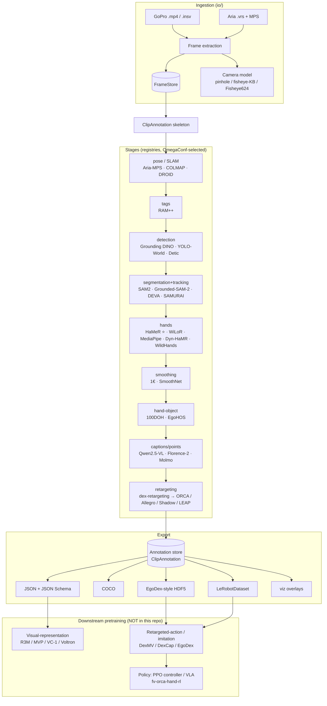

# Pipeline diagram

```mermaid
flowchart TD
    subgraph INGEST["Ingestion (io/)"]
        V[GoPro .mp4 / .insv] --> F[Frame extraction]
        A[Aria .vrs + MPS] --> F
        F --> FS[(FrameStore)]
        F --> CAM[Camera model<br/>pinhole / fisheye-KB / Fisheye624]
    end

    FS --> CLIP[ClipAnnotation skeleton]

    subgraph STAGES["Stages (registries, OmegaConf-selected)"]
        direction TB
        POSE["pose / SLAM<br/>Aria-MPS · COLMAP · DROID"] --> TAGS
        TAGS["tags<br/>RAM++"] --> DET
        DET["detection<br/>Grounding DINO · YOLO-World · Detic"] --> SEG
        SEG["segmentation+tracking<br/>SAM2 · Grounded-SAM-2 · DEVA · SAMURAI"] --> HANDS
        HANDS["hands<br/>HaMeR ⭐ · WiLoR · MediaPipe · Dyn-HaMR · WildHands"] --> SMOOTH
        SMOOTH["smoothing<br/>1€ · SmoothNet"] --> HOI
        HOI["hand-object<br/>100DOH · EgoHOS"] --> CAP
        CAP["captions/points<br/>Qwen2.5-VL · Florence-2 · Molmo"] --> RET
        RET["retargeting<br/>dex-retargeting → ORCA / Allegro / Shadow / LEAP"]
    end

    CLIP --> POSE
    RET --> STORE[(Annotation store<br/>ClipAnnotation)]

    subgraph EXPORT["Export"]
        STORE --> J[JSON + JSON Schema]
        STORE --> C[COCO]
        STORE --> H[EgoDex-style HDF5]
        STORE --> L[LeRobotDataset]
        STORE --> Z[viz overlays]
    end

    subgraph PRETRAIN["Downstream pretraining (NOT in this repo)"]
        J --> VR[Visual-representation<br/>R3M / MVP / VC-1 / Voltron]
        H --> IM[Retargeted-action / imitation<br/>DexMV / DexCap / EgoDex]
        L --> IM
        IM --> POL[Policy: PPO controller / VLA<br/>fv-orca-hand-rl]
    end
```

Legend: ⭐ = default for that family. Heavy stages load lazily; in `dry_run` they
emit deterministic synthetic outputs so the whole graph runs on CPU with no
weights.
